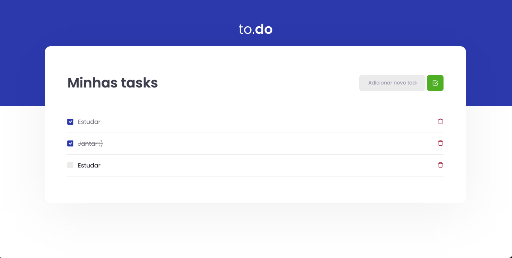

# Desafio conceitos React.

## Objetivo
O objetivo deste projeto consiste em um concluir o desafio, proposto no primeiro modulo pela rocketseat, onde foi ensinado sobre:

 - useState.
 - useEffect.
 - components.
 - requisições.
 - Importancia da utilização do TS, entre várias outros aprendizados :)

## Demo:




## Rodar na sua maquina:

Baixe o projeto, com o seguinte comando:  
```bat
git clone https://github.com/Chrystiansantos/desafio-conceitos-react.git
```

### Yarn

No terminal execute:  

```bat
cd desafio-conceitos-react
yarn
yarn dev
```

Para executar sua aplicação, você irá abrir o navegador e acessar a seguinte url:

http://localhost:8080/
